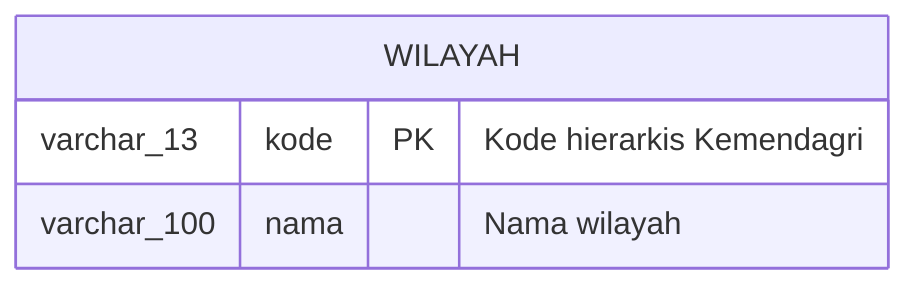
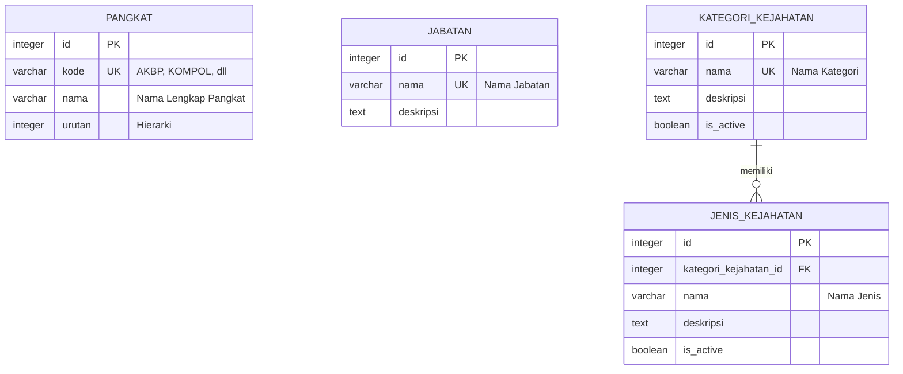
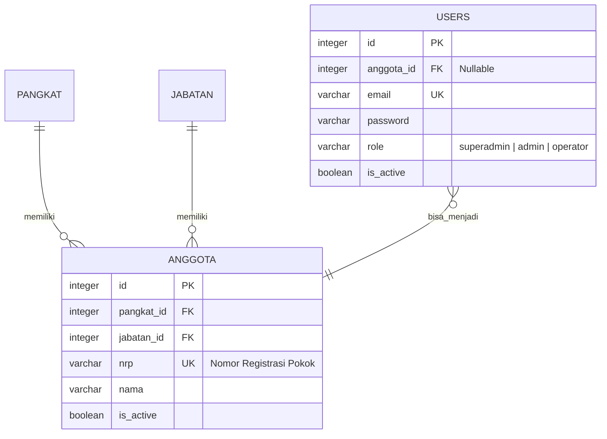
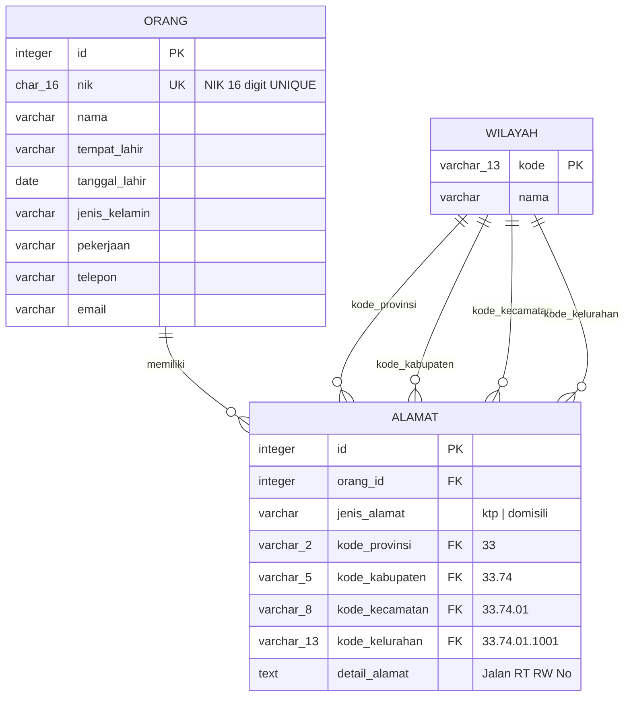
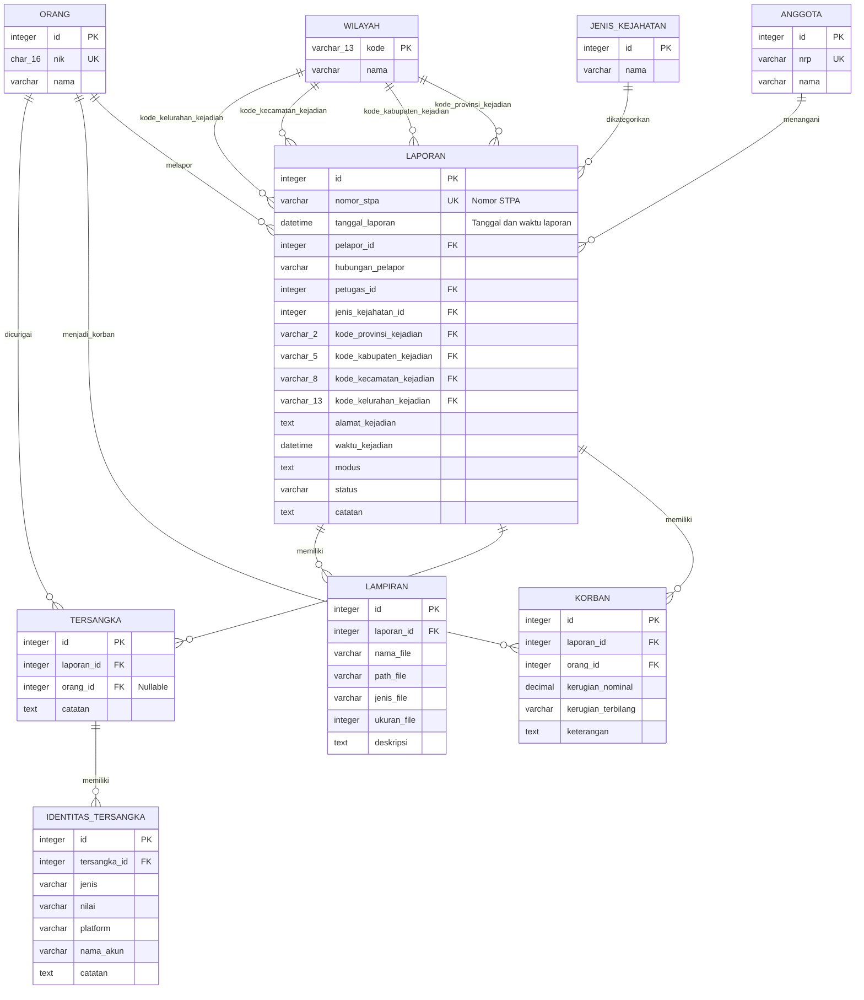
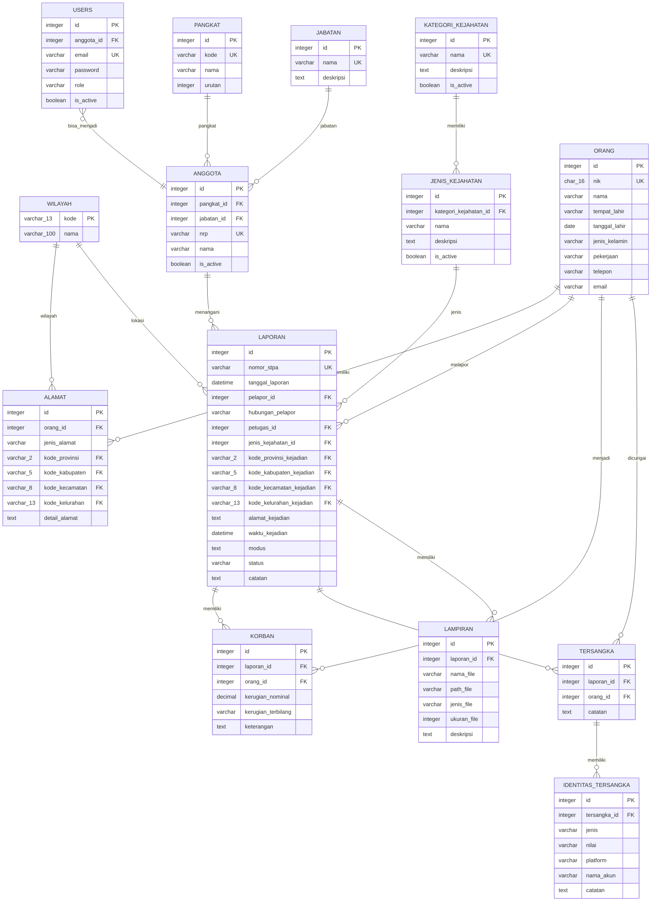

# Entity Relationship Diagram (Refactored)
## Sistem Laporan Kejahatan Siber - POLDA JATENG
### Konvensi: Bahasa Indonesia | Data Wilayah: Single Table (cahyadsn/wilayah)

**Referensi Data Wilayah:** [github.com/cahyadsn/wilayah](https://github.com/cahyadsn/wilayah)

---

## Format Kode Wilayah (Kemendagri)

| Level | Nama | Format | Contoh |
|-------|------|--------|--------|
| 1 | Provinsi | `XX` | `33` (Jawa Tengah) |
| 2 | Kabupaten/Kota | `XX.XX` | `33.74` (Kota Semarang) |
| 3 | Kecamatan | `XX.XX.XX` | `33.74.01` (Semarang Tengah) |
| 4 | Kelurahan/Desa | `XX.XX.XX.XXXX` | `33.74.01.1001` (Miroto) |

---

## ERD - Master Data Wilayah (Single Table)



**Contoh Data:**
```
kode          | nama
--------------+------------------
33            | Jawa Tengah
33.74         | Kota Semarang
33.74.01      | Semarang Tengah
33.74.01.1001 | Miroto
```

---

## ERD - Master Data Kepolisian & Kejahatan



---

## ERD - Users & Anggota



---

## ERD - Orang & Alamat (Denormalized Wilayah)



---

## ERD - Laporan Kejahatan (Core)



---

## ERD - Full Diagram



---

## Legenda

| Simbol | Keterangan |
|--------|------------|
| PK | Primary Key |
| FK | Foreign Key |
| UK | Unique Key |
| `\|\|--o{` | One-to-Many |
| `}o--\|\|` | Many-to-One (Optional) |

---

## Catatan Penting

1. **Tabel `wilayah` adalah Single Table** - berisi semua level (provinsi, kab/kota, kecamatan, kelurahan)
2. **Kode wilayah hierarkis** - dari `33.74.01.1001` bisa extract `33`, `33.74`, `33.74.01`
3. **Alamat denormalized** - simpan kode_provinsi, kode_kabupaten, kode_kecamatan, kode_kelurahan untuk kemudahan query
4. **`users.anggota_id` adalah NULLABLE** - User bisa standalone tanpa jadi anggota polisi
5. **`orang.nik` adalah UNIQUE** - Satu NIK = satu record orang
6. **Pelapor ≠ Korban** - Pelapor bisa mewakili korban lain
7. **`tersangka.orang_id` bisa NULL** - Untuk tersangka yang belum teridentifikasi
